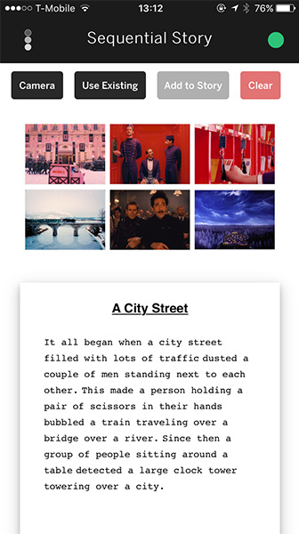
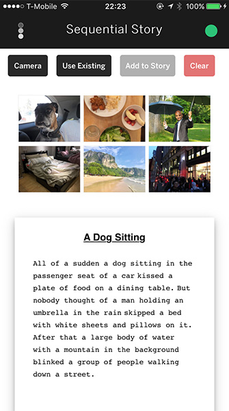

# Sequential Stories

The Show and Tell model is a image-to-text model for Tensorflow, developed by Google DeepMind, that takes an input and learns how to describe the content of images. This experimental iOS app uses this feature to generate a series of captions and create a story.

  <iframe src="https://www.youtube.com/embed/HKbVuHrpphI" frameborder="0" allow="autoplay; encrypted-media" allowfullscreen></iframe>

  

    
  

  

    
  

