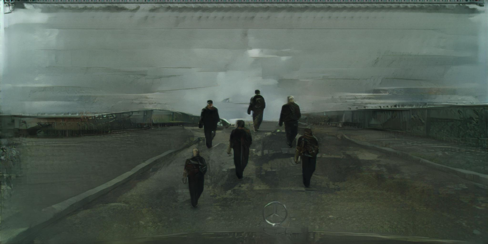
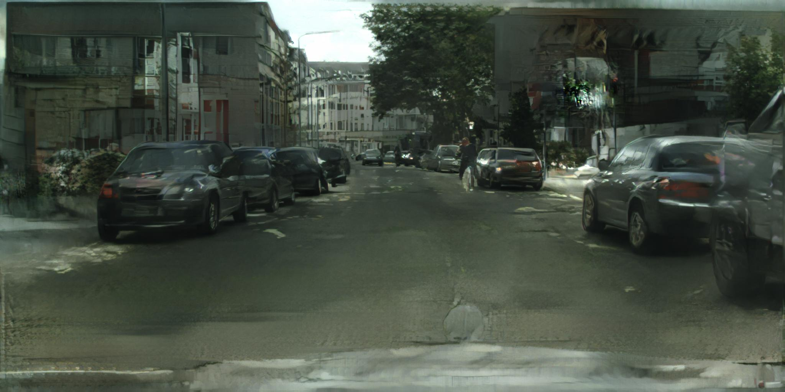
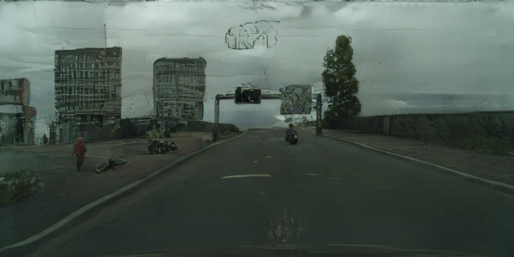
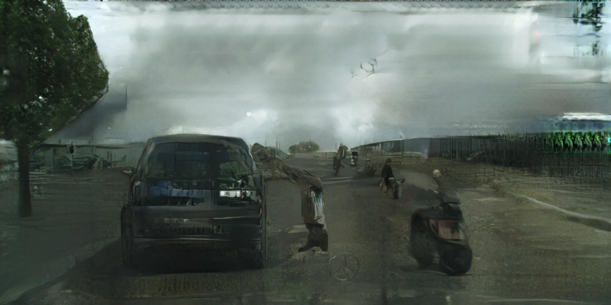
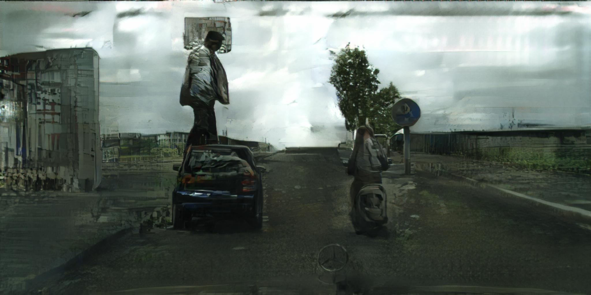
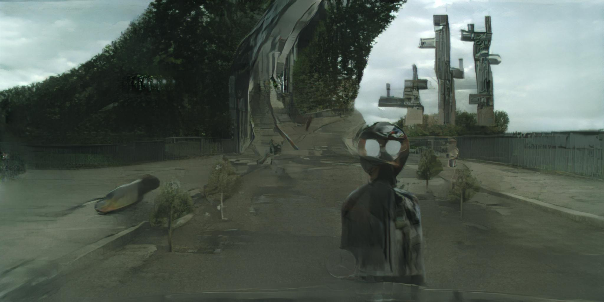

# Uncanny Rd

<a href='http://uncannyroad.com/'><h6>Go to Live Project</h6></a>

Uncanny Rd. is a drawing tool that allows users to interactively synthesise street images with the help of Generative Adversarial Networks (GANs). The project uses two AI research papers published this year as a starting point (Image-to-Image Translation Using Conditional Adversarial Networks by Isola et al. and High-Resolution Image Synthesis and Semantic Manipulation with Conditional GANs by Wang et al.) to explore the new kinds of human-machine collaboration that deep learning can enable.

 

Users of Uncanny Rd. interact with a semantic colormap of a scene, where each color represents a different kind of object label (e.g. road, building, vegetation, etc.). The neural network model was trained using adversarial learning on the Cityscapes dataset, which contains street images from a number of German cities.

<iframe src="https://player.vimeo.com/video/250328464?color=ffffff&title=0&byline=0&portrait=0" style="position:absolute;top:0;left:0;width:100%;height:100%;" frameborder="0" webkitallowfullscreen mozallowfullscreen allowfullscreen></iframe>
</script>

  

  

  

  

  

  

  

  

